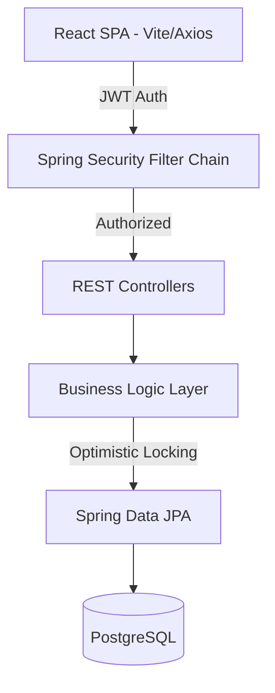
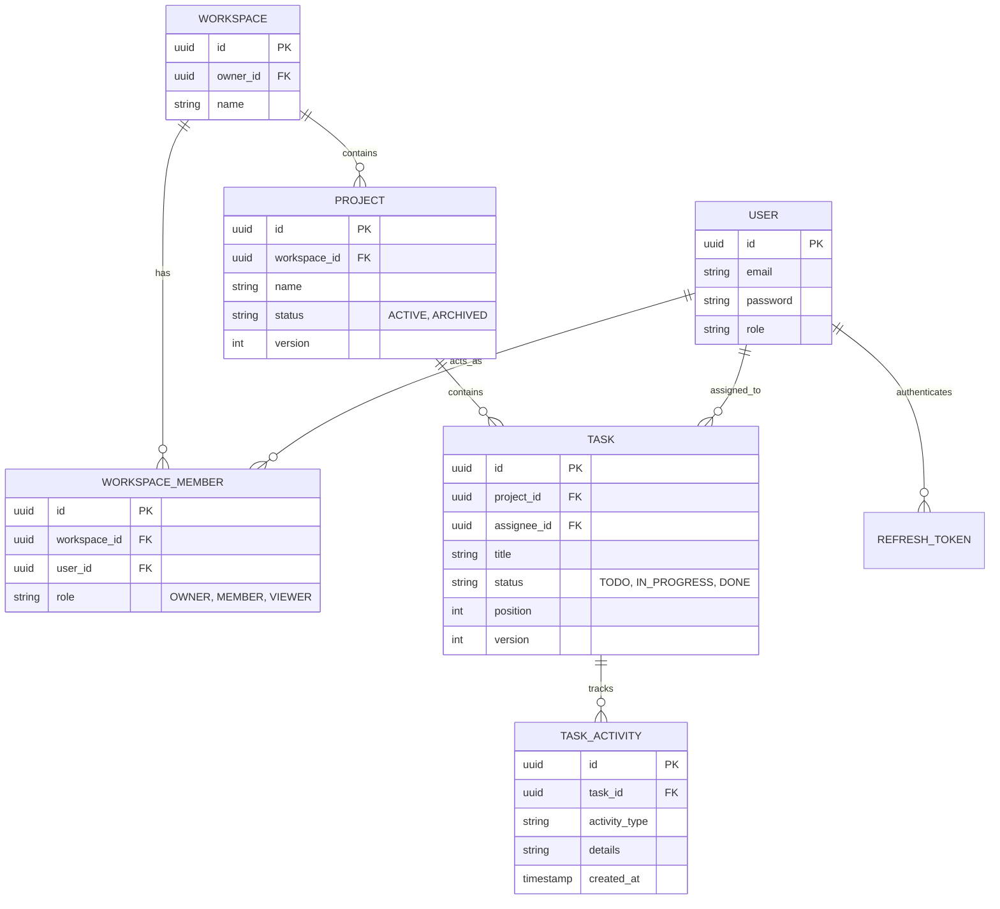

# AgileTrack

AgileTrack is a production-ready, full-stack Kanban project management application engineered to handle concurrent workflows securely. Built with React (TypeScript) and Spring Boot, it strictly enforces tenant isolation, role-based access control (RBAC), optimistic locking for drag-and-drop actions, and stateless JWT authentication.

## System Architecture



## Key Features

- **Strict Tenant Isolation**: All resources (Projects, Tasks) are completely isolated by Workspace ID. Server-side validation guarantees users cannot spoof or access cross-tenant data.
- **Role-Based Access Control (RBAC)**: Users are assigned `OWNER`, `MEMBER`, or `VIEWER` roles per workspace, enforcing strict mutation limits. 
- **Optimistic Concurrency Control (409)**: Simultaneous drag-and-drop or state-change collisions are caught via Entity `@Version` numbers. The UI optimistically updates, but instantly rolls back on a `409 Conflict` and alerts the user.
- **Stateless Secure Authentication**: Secure short-lived access tokens combined with long-lived refresh tokens stored as SHA-256 hashes in the database.
- **Robust Audit Trails**: An immutable task activity history subsystem records every assignment, status change, and critical mutation.
- **PostgreSQL Native Tooling**: Flyway migrations strictly manage the database schema (V1-V11).
- **Test-Driven Reliability**: 78+ passing backend integration tests executing against ephemeral PostgreSQL Testcontainers, and frontend behavioral tests verifying complex UI states via Vitest and React Testing Library.

## Entity-Relationship Diagram



## Engineering & Design Decisions

### 1. Tenant Isolation & Business Rules
Instead of merely guarding endpoints, business rules are embedded deep within the Service layer. Cross-tenant spoofing is impossible because nested resources (like Tasks) are explicitly validated against their parent chain (`Task -> Project -> Workspace -> Authorized User`). Archived projects are strictly locked from mutation.

### 2. Resolving Concurrency with Optimistic Locking
In a real-world Kanban board, users frequently move tasks simultaneously. Instead of relying on "last write wins" which overwrites data, AgileTrack implements Hibernate `@Version` locking. If User A and User B move the same task simultaneously, User B receives a `409 Conflict`. The frontend detects this, rolls back the optimistic drag-and-drop, and prompts User B to refresh.

### 3. JWT Refresh Token Architecture
Access tokens are deliberately kept short-lived (e.g., 15 minutes) to minimize the attack surface of a leaked token. When expired, the frontend seamlessly uses a long-lived Refresh Token to negotiate a new session. To prevent database theft, refresh tokens are stored exclusively as `SHA-256` hashes on the server.

### 4. Performance Scaling
Extensive `EXPLAIN (ANALYZE, BUFFERS)` benchmarking was performed on PostgreSQL to validate that sequential textual searches (`ILIKE`) perform within an acceptable budget (~21ms) even at 10,000 tasks per project. A heavy `pg_trgm` GIN index was evaluated and explicitly rejected to save on `INSERT/UPDATE` penalties given the tenant-scoped data bounds.

## Deployment & Production Configuration

The application features a strict `application-prod.yaml` profile that completely disables insecure fallbacks, relying exclusively on environment variables for secrets.

### Required Production Environment Variables (Backend)
```env
DATABASE_URL=jdbc:postgresql://<host>:5432/<db>
DATABASE_USERNAME=postgres
DATABASE_PASSWORD=...
JWT_SECRET=... # 256-bit secure key
FRONTEND_ORIGIN=https://agiletrack-ui.vercel.app # Strictly enforced CORS
```

### Required Production Environment Variables (Frontend)
```env
VITE_API_URL=https://api.agiletrack.com/api/v1
```

### Run Locally (Docker)
Ensure Docker is running, then execute:
```bash
docker-compose up --build
```
- Frontend: `http://localhost:3000`
- API proxy: `http://localhost:3000/api/v1`

---
*Built as a showcase for production-grade React/Spring Boot architecture.*
