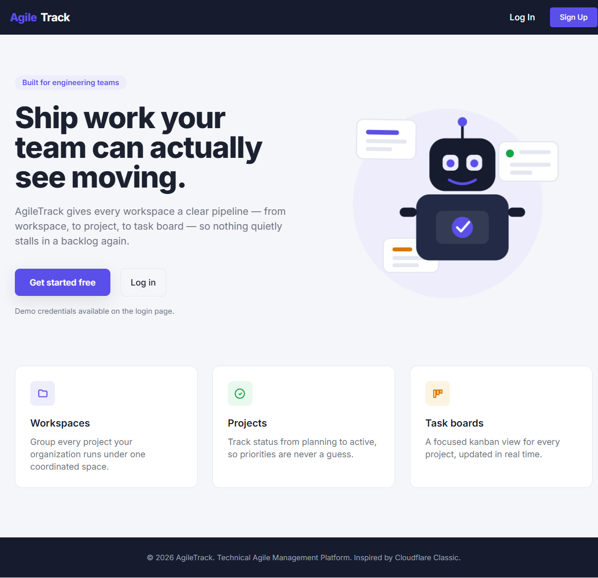
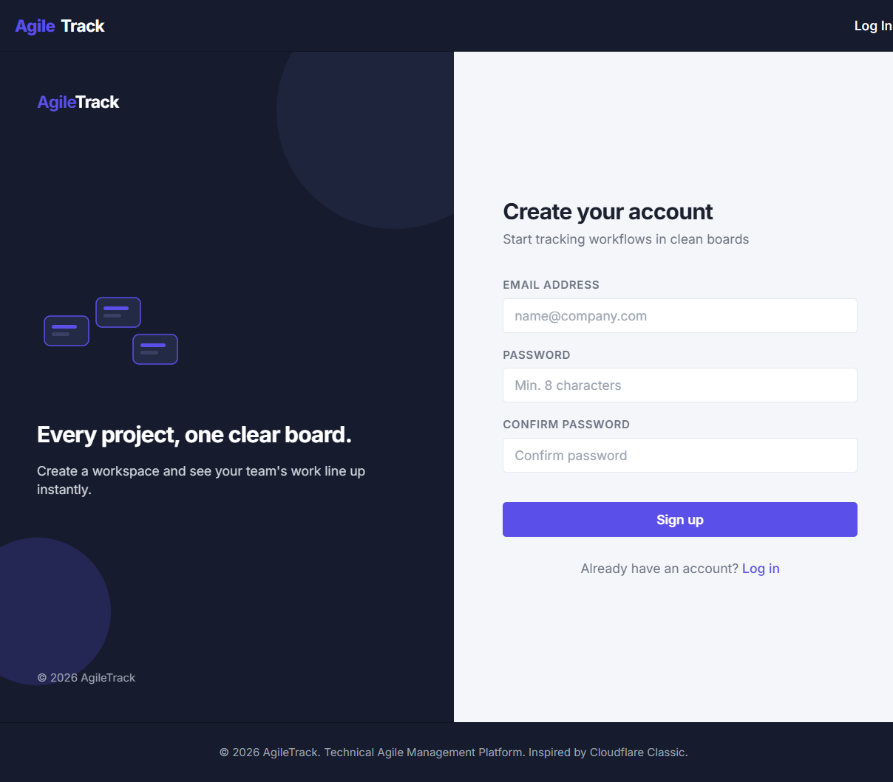
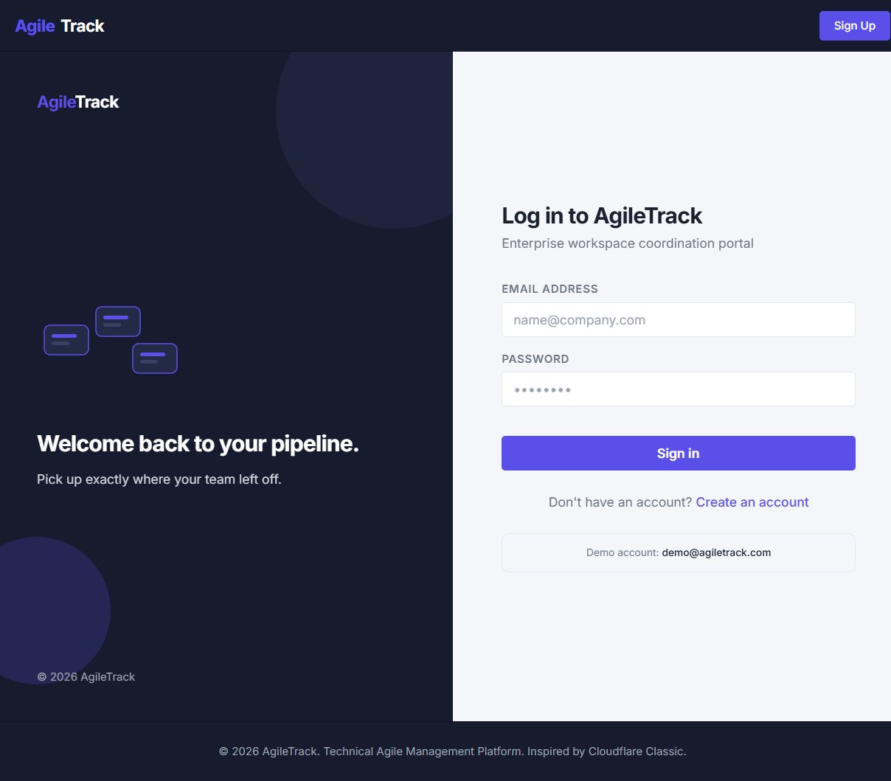
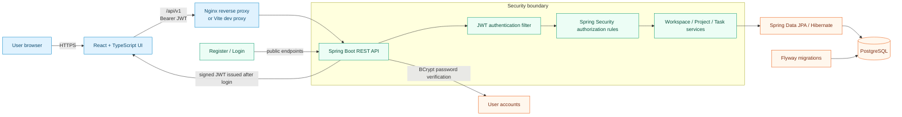
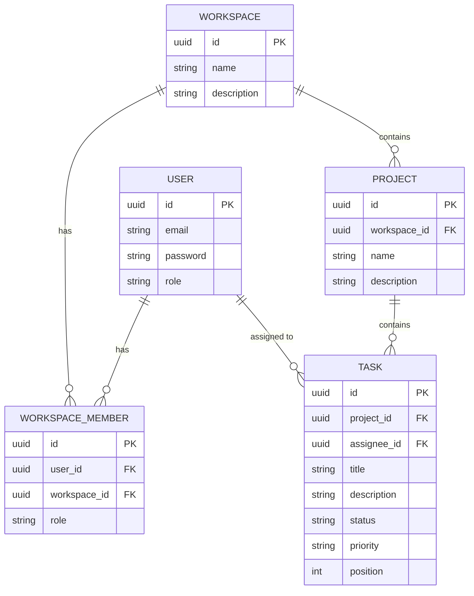

# AgileTrack

[](https://github.com/0-YuvrajSingh/AgileTrack/actions)
[](https://openjdk.org/projects/jdk/21/)
[](https://spring.io/projects/spring-boot)
[](https://react.dev/)
[](https://www.postgresql.org/)
[](https://www.docker.com/)
[](LICENSE)

AgileTrack is a full-stack Agile management portal for organizing workspaces, projects, and collaborative task boards. A responsive React interface is backed by a Spring Boot REST API and PostgreSQL, with JWT authentication, versioned database migrations, and a container-ready development workflow.

[Explore the live app](https://agile-track-ivory.vercel.app/login) | [View API documentation](#swagger--openapi-docs) | [Run locally](#quick-start-with-docker-recommended)

---

## Preview

### Product Overview


### Create an Account


### Log In

---

## Feature Highlights

| Organize | Plan | Protect | Ship |
|---|---|---|---|
| Create distinct workspaces and projects to keep teams and initiatives separated. | Move tasks across the board with drag-and-drop status updates and persistent custom ordering. | Register and sign in through a stateless JWT flow; protected API routes enforce authenticated access. | Start the full frontend, API, and database stack with Docker Compose and keep schemas in sync with Flyway. |

- **Task visibility at a glance**: Track title, description, assignee, priority, status, and board position in one workflow.
- **Responsive workspace**: React, TypeScript, Tailwind CSS, and Lucide icons provide a clean interface across screen sizes.
- **Production-minded API**: Centralized error handling, OpenAPI/Swagger docs, CORS controls, and health endpoints support reliable integrations and deployments.

---

## Architecture & Security

AgileTrack is a decoupled monorepo: the browser app communicates only with the REST API, and the API owns authentication, authorization, business rules, and database access.



### Security at a Glance

- Passwords are hashed with BCrypt; plaintext passwords are never stored.
- Login issues a signed JWT, and the JWT filter validates it before protected endpoints are reached.
- The API is stateless, with Spring Security enforcing authentication and endpoint authorization.
- CORS is restricted to configured frontend origins, while local development origins remain supported.
- Flyway applies database migrations in versioned order, keeping environments consistent.

### Database Schema



### Tech Stack
- **Frontend**: React (v19), TypeScript, TailwindCSS, Lucide React (Icons), React Router, Axios.
- **Backend**: Java 21, Spring Boot (v3.3.5), Spring Security (JWT), Spring Data JPA, Hibernate, Flyway.
- **Database**: PostgreSQL (v15+).
- **Hosting/Containers**: Docker & Docker Compose.

### Project Structure

```text
AgileTrack/
|-- frontend/                  # React + TypeScript single-page application
|   `-- src/
|       |-- components/         # Reusable UI and layout components
|       |-- pages/              # Route-level views (dashboard, board, workspaces)
|       |-- services/           # API client layer
|       |-- context/            # Shared application state
|       `-- types/              # TypeScript domain models
|-- backend/                   # Spring Boot REST API
|   `-- src/
|       |-- main/java/com/agiletrack/backend/
|       |   |-- auth/           # Registration and login
|       |   |-- security/       # JWT services and authentication filter
|       |   |-- workspace/      # Workspace domain
|       |   |-- project/        # Project domain
|       |   |-- task/           # Task board domain
|       |   `-- common/         # Shared exceptions and API concerns
|       `-- main/resources/     # Application config and Flyway migrations
|-- screenshots/               # README product previews
|-- docker-compose.yml          # Local multi-container orchestration
`-- .env.example               # Environment-variable template
```

### Key Design Decisions

- **Feature-oriented backend packages** keep each domain's controller, service, repository, and model close together as the API grows.
- **A separate frontend and API** lets the UI evolve independently while retaining a clean, documented HTTP contract.
- **Stateless JWT authentication** suits a browser SPA and avoids server-side session storage.
- **Position-based task ordering** persists drag-and-drop ordering without coupling the board UI to a transient client state.
- **Flyway migrations over ad-hoc schema changes** make local, test, and deployed databases reproducible.

---

## Getting Started

### Live Demo
> **Live deployment:** [Open the login page](https://agile-track-ivory.vercel.app/login) (the root URL opens the dashboard directly) - register an account or use the demo credentials below.

| Role | Email | Password |
|------|-------|----------|
| Demo User | `demo@agiletrack.com` | `Demo@12345` |

### Quick Start with Docker (Recommended)

To run the entire stack (Frontend, Backend, and Database) with a single command, ensure you have Docker installed and run:

```bash
docker-compose up --build
```

- **Frontend Application**: accessible at [http://localhost:3000](http://localhost:3000)
- **Backend REST API**: proxied through the frontend at `/api/v1`
- **Database**: PostgreSQL on port `5432` (internal only)

To stop the containers and keep database volumes:
```bash
docker-compose down
```

---

### Local Development Setup

If you prefer to run the services individually without Docker, configure your local environment as follows:

#### 1. Setup PostgreSQL Database
- Create a PostgreSQL database named `agiletrack_db` on port `5432`.
- Update credentials in `backend/src/main/resources/application.yaml` or set environment variables:
  ```bash
  DATABASE_USERNAME=postgres
  DATABASE_PASSWORD=postgres
  ```

#### 2. Start the Backend
1. Navigate to the `backend/` directory.
2. Build the application and run migrations:
   ```bash
   ./mvnw spring-boot:run
   ```
   The backend will start on [http://localhost:8080](http://localhost:8080).

#### 3. Start the Frontend
1. Navigate to the `frontend/` directory.
2. Install dependencies:
   ```bash
   npm install
   ```
3. Run the development server:
   ```bash
   npm run dev
   ```
   The frontend will start on [http://localhost:5173](http://localhost:5173).

---

## API Reference

### Authentication
- `POST /api/v1/auth/register` - Register a new user account.
- `POST /api/v1/auth/login` - Authenticate a user and receive a JWT token.

### Workspaces
- `GET /api/v1/workspaces` - Retrieve all workspaces of the current user.
- `POST /api/v1/workspaces` - Create a new workspace.
- `DELETE /api/v1/workspaces/{id}` - Delete a workspace.

### Projects
- `GET /api/v1/workspaces/{workspaceId}/projects` - Retrieve all projects in a workspace.
- `POST /api/v1/workspaces/{workspaceId}/projects` - Create a project in a workspace.
- `DELETE /api/v1/workspaces/{workspaceId}/projects/{projectId}` - Delete a project.

### Tasks
- `GET /api/v1/workspaces/{workspaceId}/projects/{projectId}/tasks` - Get all tasks in a project.
- `POST /api/v1/workspaces/{workspaceId}/projects/{projectId}/tasks` - Create a new task.
- `PUT /api/v1/workspaces/{workspaceId}/projects/{projectId}/tasks/{taskId}` - Update task details.
- `DELETE /api/v1/workspaces/{workspaceId}/projects/{projectId}/tasks/{taskId}` - Delete a task.
- `PATCH /api/v1/workspaces/{workspaceId}/projects/{projectId}/tasks/{taskId}/status` - Update task status (for drag-and-drop).
- `PATCH /api/v1/workspaces/{workspaceId}/projects/{projectId}/tasks/{taskId}/position` - Reorder task positions.

---

## Swagger / OpenAPI Docs
When the backend service is running, you can explore and test the API interactively at:
[http://localhost:8080/swagger-ui/index.html](http://localhost:8080/swagger-ui/index.html)

---

## Deployment

### Environment Variables

Copy `.env.example` to `.env` and fill in:

| Variable | Description | Example |
|----------|-------------|---------|
| `JWT_SECRET` | Random 256-bit key for signing JWTs | `openssl rand -base64 32` |
| `JWT_EXPIRATION` | Access token TTL in ms (default 24h) | `86400000` |
| `JWT_REFRESH_EXPIRATION` | Refresh token TTL in ms (default 7d) | `604800000` |
| `FRONTEND_ORIGIN` | Allowed CORS origin for the API | `https://your-frontend.vercel.app` |
| `DATABASE_*` | Database credentials | See `.env.example` |

### Deploy to Vercel + Render (Recommended for Students)

**Frontend (Vercel):**
1. Push to GitHub, import in [vercel.com](https://vercel.com)
2. Set env var `VITE_API_BASE_URL` to your backend URL (e.g. `https://your-app.onrender.com/api/v1`). Note: This variable is baked into the frontend static bundle at build time and is also used for dev proxying locally.

**Backend (Render):**
1. Create a free Web Service on [render.com](https://render.com)
2. Set the Root Directory to: `backend`
3. Build command: `./mvnw clean package -DskipTests`
4. Start command: `java -jar target/backend-0.0.1-SNAPSHOT.jar`
5. Add env vars: `DATABASE_URL`, `JWT_SECRET`, `FRONTEND_ORIGIN`, etc.

**Database (Neon or Supabase free tier):**
1. Create a PostgreSQL database
2. Use the connection string as `DATABASE_URL` (format: `jdbc:postgresql://host:5432/dbname?sslmode=require`)
